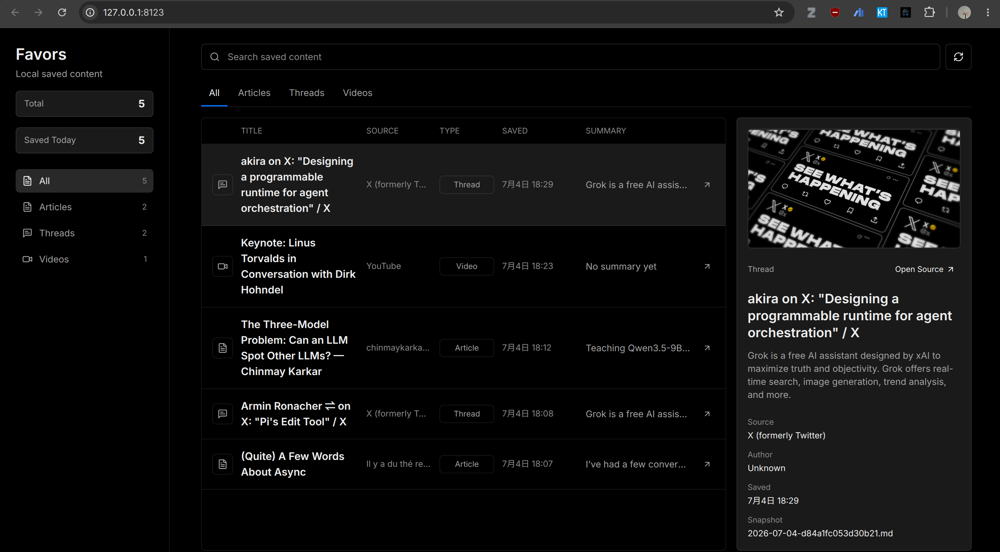

# Favors

<p align="center">
  
</p>

**Favors is a local-first content library.** Save articles, X/Twitter threads, and
YouTube videos with one click in Chrome — then search and re-read them in a dark,
offline web library that runs entirely on your own machine.

<p align="center">
  
</p>

## Why Favors

Most "read it later" tools are either a cloud account that reads your data, or a
hand-rolled script that needs a Node/Python runtime always running. Favors is
neither: it is a single Rust binary that wakes on demand, does its work, and gets
out of the way.

- **Near-zero footprint when idle.** The daemon resident set sits around
  7 MB (only ~1.2 MB of private anonymous memory), runs in a single thread,
  and exits after 5 idle minutes. On Linux it is started on demand by a systemd
  socket, so nothing is running until you actually save something. See the
  measured footprint below.
- **Truly local-first.** Everything is served on `127.0.0.1`. No account, no
  telemetry, no third-party sync. Your reads never leave the machine.
- **Single binary, zero runtime.** `favorsd` (~10 MB on disk) bundles the HTTP
  server, content extractor, and a statically-linked SQLite. No Node, no
  Python, no Docker required to run it.
- **Your data stays portable.** Metadata in one SQLite file, every snapshot as a
  plain Markdown file with frontmatter. Read it with any tool, move it anywhere.

## Features

**Capture**
- One-click save from a Chrome Manifest V3 extension (plain JS, no build step).
- Articles, X/Twitter threads, and YouTube videos, auto-detected from the URL.

**Extraction**
- Readability-based body extraction and clean Markdown snapshots.
- OG / meta-tag metadata: title, author, site name, description, thumbnail,
  publish date.
- YouTube titles, authors, and thumbnails via oEmbed — generic placeholder
  values are detected and replaced.
- Tracking parameters (`utm_*`, `fbclid`, `gclid`, …) and URL fragments are
  stripped, and saves are de-duplicated by canonical URL.

**Retrieval**
- Full-text search powered by SQLite FTS5 with BM25 ranking.
- Filter by source type; dark, searchable web library at `http://127.0.0.1:8123`.
- Original source is always one click away.

## How it works

```text
Chrome extension ──POST /api/save──▶ favorsd (127.0.0.1:8123)
                                       │
                            ┌──────────┴──────────┐
                            ▼                     ▼
                    data/favors.sqlite      data/items/*.md
                   (metadata + FTS5)       (Markdown snapshot)
```

The extension collects a page snapshot in the tab and posts it to the local
daemon. The daemon fetches the article body (only when needed), extracts
metadata, writes a Markdown snapshot, and upserts a row into SQLite. The web
library reads from the same SQLite file. Nothing calls out to Favors-hosted
servers — there are none.

## Install

### Linux & macOS

```bash
./scripts/install.sh
```

The installer downloads the matching prebuilt package, installs it into your user
profile, and registers the local daemon. Then load the Chrome extension (see
below) and open `http://127.0.0.1:8123`.

On Linux the socket stays available while the daemon is stopped: systemd starts
`favorsd` on the first request, and the daemon exits after 5 idle minutes — so
Favors consumes essentially no resources between saves.

### Windows

```powershell
.\scripts\install.ps1
```

Registers a hidden startup task on login.

## Load the Chrome extension

The extension is plain Manifest V3 JavaScript — no Chrome Web Store upload or
build step is required for local use.

1. Install the local Favors service first (see above).
2. Open `chrome://extensions` and enable **Developer mode**.
3. Click **Load unpacked** and select the `extension/` folder shipped next to
   the installer (the one containing `manifest.json`).

   From this repo, select:

   ```text
   /path/to/favors/apps/extension          # Linux / macOS
   C:\path\to\favors\apps\extension        # Windows
   ```

   Do not select the repo root, `apps/`, or a zip file.

4. Pin the Favors icon from Chrome's extensions menu.
5. Open any article, X/Twitter thread, or YouTube video, then click the icon.

After `git pull`, reopen `chrome://extensions` and click reload on the Favors
card.

## Usage

1. Browse an article, X/Twitter thread, or YouTube video.
2. Click the Favors extension icon — the badge shows `OK` when saved.
3. Open `http://127.0.0.1:8123` to search, filter, and open the original source.

## Local data

- SQLite metadata + full-text index: `data/favors.sqlite` (WAL mode)
- Markdown snapshots: `data/items/*.md`
- Downloaded / generated assets: `data/assets/`

## Measured footprint

Numbers below come from the release binary of `favorsd` running standalone on
Linux (no systemd). The daemon was started, measured idle, then measured again
after one `POST /api/save` that fetched a remote page and wrote a Markdown
snapshot + SQLite row.

| State | RSS | Private anonymous (RssAnon) | Peak (VmHWM) | Threads |
| --- | ---: | ---: | ---: | ---: |
| Idle, just started | 7.4 MB | 1.2 MB | 7.4 MB | 1 |
| After one save | 11.0 MB | 1.5 MB | 11.0 MB | 1 |

Disk footprint:

| Artifact | Size |
| --- | ---: |
| `favorsd` binary | 10 MB |
| Web static dist | 224 KB |
| On-disk data after one save | 40 KB |

The bulk of RSS is read-only code pages mapped from the binary (`RssFile`),
which the kernel can drop and re-page under memory pressure. The memory Favors
actually owns (`RssAnon`) stays around 1–2 MB, and the process is single-
threaded throughout — no thread pool, no background workers.

<details>
<summary>Reproduce the measurement</summary>

```bash
TEST_ROOT=/tmp/favors-bench
rm -rf "$TEST_ROOT" && mkdir -p "$TEST_ROOT/data" "$TEST_ROOT/web"
echo '<html><body></body></html>' > "$TEST_ROOT/web/index.html"

FAVORS_ADDR=127.0.0.1:8211 \
FAVORS_ROOT="$TEST_ROOT" \
FAVORS_DATA_DIR="$TEST_ROOT/data" \
FAVORS_WEB_DIR="$TEST_ROOT/web" \
FAVORS_IDLE_SECONDS=999999 \
apps/daemon/target/release/favorsd &
PID=$!
sleep 0.6

# idle state
ps -o pid,rss,vsz,nlwp,cmd -p "$PID"
grep -E 'VmRSS|VmSize|VmHWM|RssAnon|Threads' /proc/$PID/status

# one save
curl -s -X POST http://127.0.0.1:8211/api/save \
  -H 'content-type: application/json' \
  -d '{"url":"https://example.com/"}' >/dev/null

# runtime state
ps -o pid,rss,vsz,nlwp,cmd -p "$PID"
grep -E 'VmRSS|VmSize|VmHWM|RssAnon|Threads' /proc/$PID/status

# disk
ls -lh apps/daemon/target/release/favorsd
du -sh apps/web/dist "$TEST_ROOT/data"

kill "$PID"; wait 2>/dev/null
```

</details>

## Development

Requires Node.js 22+, Rust/Cargo, and SQLite development headers.

```bash
npm install
npm run build          # build web + daemon
npm run dev:server     # favorsd in the foreground
npm run dev:web        # Vite dev UI at http://127.0.0.1:5173
```

For a foreground production run without systemd:

```bash
npm start
```

To package the current build for a target platform:

```bash
npm run package:release -- linux-x64
```

Releases are cross-built for `linux-x64`, `macos-x64`, `macos-arm64`, and
`windows-x64` via GitHub Actions.
